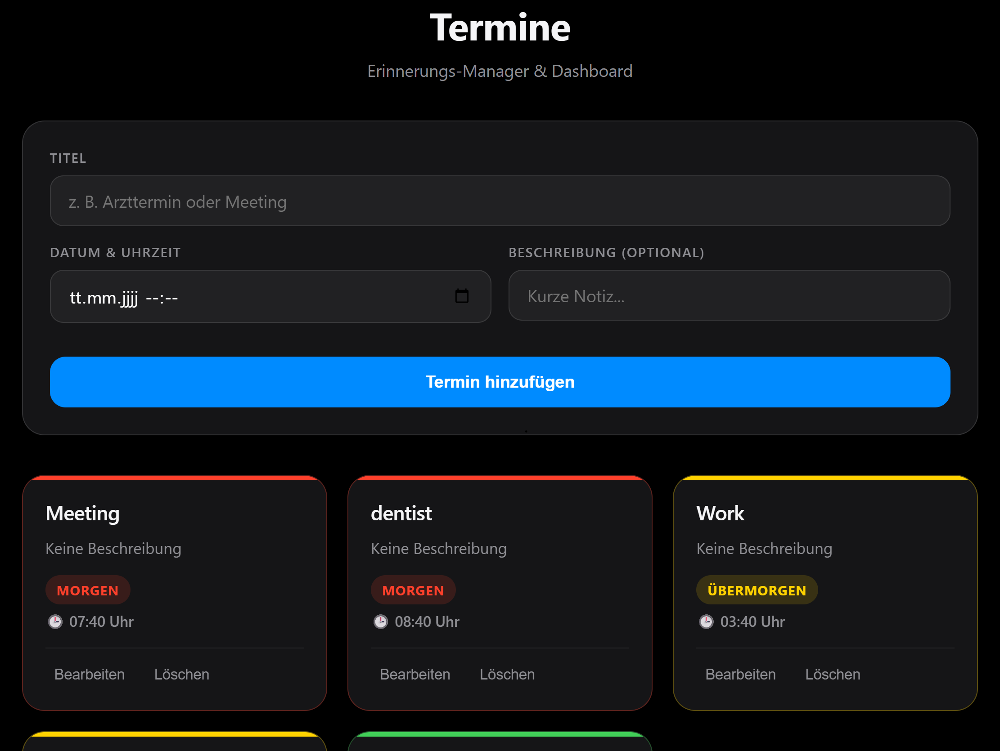

# 📌 Raspberry Pi 5 Event & Task Manager

A simple dark-mode web app running on Raspberry Pi 5 to manage appointments and To-Dos with 1-day email reminders and red-to-green priority cards.

  

## ✨ Features
- **Smart UI:** Modern Apple-style dark mode with color-coded priority cards (red to green).
- **Email Reminders:** Automatic email notification sent 1 day before an appointment.
- **Auto-Cleanup:** Completed tasks are automatically deleted every day at midnight (0:00).
- **Full Control:** Easily add, edit, and delete events or To-Dos directly in the web interface.
- 
## 🔍 Code Insights & Logic

### 🌐 Network & Remote Access via Tailscale
The backend server runs directly on the **Raspberry Pi 5** within a private **Tailscale VPN network**. This architecture allows secure access to the web interface from anywhere without exposing ports to the public internet:

1. **Host System:** The Raspberry Pi 5 hosts the Flask server and SQLite database locally.
2. **Secure Requests:** Any connected client device (e.g., your smartphone) sends HTTP requests through the encrypted Tailscale mesh network.
3. **Background Services:**
   - **Threaded Mail Dispatcher:** Checks upcoming events every minute and triggers SMTP email alerts 24 hours prior.
   - **Midnight Auto-Cleanup:** Automatically purges completed tasks every day at 0:00 midnight.
   - **Nohup Execution:** Managed via `start.sh`, ensuring the backend runs persistently even after closing SSH sessions.
