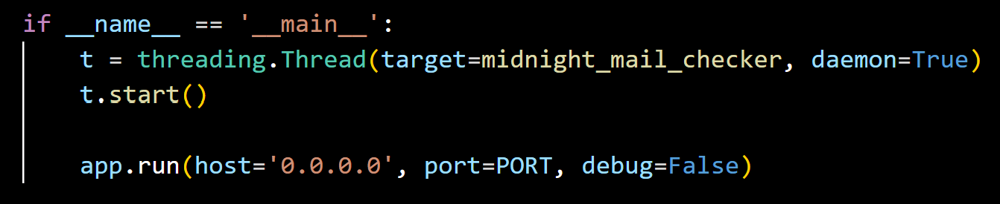
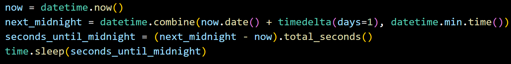
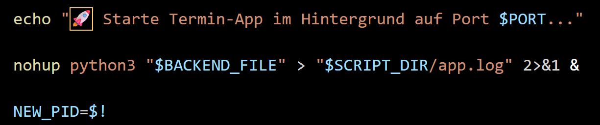

# 📌 Raspberry Pi 5 Event & Task Manager

A simple dark-mode web app running on Raspberry Pi 5. It helps you manage appointments and To-Dos with 1-day email reminders and red-to-green priority cards.

  

## ✨ Features
- **Smart UI:** Modern dark mode with red, yellow, and green cards based on urgency.
- **Email Reminders:** Gets an email notification 1 day before an appointment.
- **Auto-Cleanup:** Deletes finished tasks automatically every night at midnight (0:00).
- **Easy Control:** Add, edit, and delete events or To-Dos directly in your browser.

## 📁 File Structure

- **backend.py** — Python server and background tasks
- **start.sh** — Easy script to start, restart, or stop the app
- **events.db / todos.db** — SQLite database files (created automatically)
- **app.log** — Log file for background activity
- **termin-manager-1.png** — Preview picture
- **frontend/template/index.html** — Dark Mode Web Interface

## 💾 Database & Storage

The app uses **SQLite3** (`events.db` and `todos.db`) to save data safely.

- **Simple Setup:** Everything is saved in local files. No complex database server needed.
- **Safe Data:** Works much better than simple `.txt` files when reading and writing data.
- **Auto-Create:** Tables are created automatically when you run `backend.py` for the first time.

## 🔍 How It Works

### 🌐 Secure Remote Access with Tailscale
The app runs on your **Raspberry Pi 5** inside a private **Tailscale VPN network**. This means you can open the app safely from anywhere without opening public ports:

1. **Host:** The Raspberry Pi 5 runs the Flask server and SQLite database locally.
2. **Connection:** Your phone or PC connects securely through the encrypted Tailscale network.
3. **Background Tasks:**
   - **Mail System:** Checks upcoming events and sends email alerts 24 hours before.
   - **Midnight Cleanup:** Deletes finished tasks every night at midnight.
   - **Background Running:** The `start.sh` script keeps the server active even when you close the SSH terminal.

## 📸 Code Highlights & Key Functions

### 1. Running Tasks in Background (`backend.py`)

  

* **Background Thread:** Starts the email checker on an extra background thread (`daemon=True`). This keeps the web interface fast because background tasks do not block incoming HTTP requests.

---

### 2. Midnight Timer Logic (`backend.py`)

  

* **Smart Sleep:** Calculates the exact seconds until midnight (`seconds_until_midnight`). The app sleeps until midnight instead of checking the database every second. This saves CPU power.

---

### 3. Keeping the App Alive (`start.sh`)

  

* **Background Execution:** Starts the server using `nohup` and `&`. This keeps the app running continuously on the Raspberry Pi 5 even if you disconnect from SSH, and saves all outputs to `app.log`.
